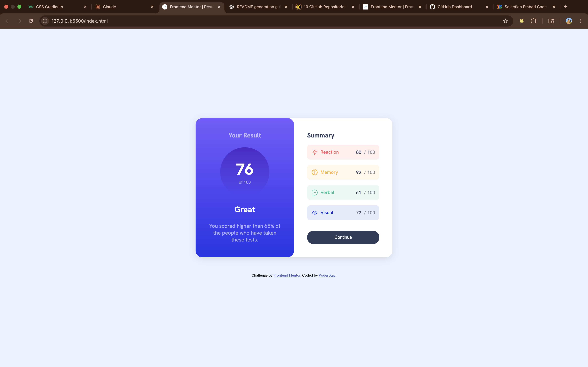

# Frontend Mentor - Results summary component solution

This is a solution to the [Results summary component challenge on Frontend Mentor](https://www.frontendmentor.io/challenges/results-summary-component-CE_K6s0maV). Frontend Mentor challenges help you improve your coding skills by building realistic projects.

## Table of contents

- [Overview](#overview)
  - [The challenge](#the-challenge)
  - [Screenshot](#screenshot)
  - [Links](#links)
- [My process](#my-process)
  - [Built with](#built-with)
  - [What I learned](#what-i-learned)
  - [Continued development](#continued-development)
  - [Useful resources](#useful-resources)
- [Author](#author)

## Overview

### The challenge

Users should be able to:

- View the optimal layout for the interface depending on their device's screen size
- See hover and focus states for all interactive elements on the page
- **Bonus**: Use local JSON data to dynamically populate the content (not implemented in this solution)

### Screenshot



### Links

- Solution URL: (https://github.com/CoderBlack25/results-summary)

## My process

### Built with

- Semantic HTML5 markup
- CSS custom properties
- Flexbox
- Mobile-first workflow

### What I learned

While working on this project, I reinforced my knowledge of:

- Using **CSS variables** (`:root`) to manage colors and transparency efficiently.
- Creating a **gradient background** for sections and circular score containers.
- Building a **responsive card layout** with `flexbox` that adapts from desktop (two-column) to mobile (stacked) view.
- Styling hover states with **linear-gradient backgrounds**.

Here’s an example snippet I’m proud of:

```css
.score {
  background-image: linear-gradient(var(--violet-blue), var(--persian-blue));
  display: flex;
  justify-content: center;
  align-items: center;
  border-radius: 50%;
  width: 150px;
  height: 150px;
}

### Continued development

In future projects, I want to focus more on:

- Using JavaScript to dynamically load and display scores from JSON.

- Exploring CSS Grid alongside Flexbox for more complex layouts.

- Improving accessibility (aria labels, roles, better color contrast).

### Useful resources

- [MDN CSS documentation](https://developer.mozilla.org/en-US/docs/Web/CSS)
  Helped me revisit some flexbox and gradient properties.

- [Frontend Mentor Slack/Community](https://www.frontendmentor.io/slack)
  Great place to see how others tackled the same challenge.

- [W3Schools HTML and CSS Tutorials] (https://www.w3schools.com)

## Author

- Frontend Mentor - [@CoderBlack25](https://www.frontendmentor.io/profile/CoderBlack25)
- Twitter - [@dWeb3Oracle](https://www.twitter.com/dWeb3Oracle)
```
